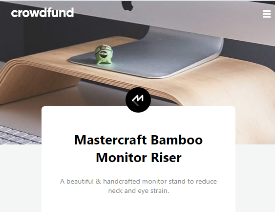

# Frontend Mentor - Crowdfunding product page solution

This is a solution to the [Crowdfunding product page challenge on Frontend Mentor](https://www.frontendmentor.io/challenges/crowdfunding-product-page-7uvcZe7ZR). Frontend Mentor challenges help you improve your coding skills by building realistic projects.

## Table of contents

- [Overview](#overview)
  - [The challenge](#the-challenge)
  - [Screenshots](#screenshots)
  - [Links](#links)
- [My process](#my-process)
  - [Summary](#summary)
  - [Built with](#built-with)
- [Author](#author)

**Note: Delete this note and update the table of contents based on what sections you keep.**

## Overview

### The challenge

Users should be able to:

- View the optimal layout depending on their device's screen size
- See hover states for interactive elements
- Make a selection of which pledge to make
- See an updated progress bar and total money raised based on their pledge total after confirming a pledge
- See the number of total backers increment by one after confirming a pledge
- Toggle whether or not the product is bookmarked

### Screenshots

Desktop Design:

Mobile Design:

Special parts:

### Links

- Solution URL: [https://eliman-c5.github.io/crowdfunding-challenge/](https://eliman-c5.github.io/crowdfunding-challenge)

## My process

### Summary

I used some colors to create an optimal layout and make it as equal as examples. I use font size based on 16px. When width decreases or increases, the font size changes and make design keep optimal.
The design were create to widths mentioned (375px / 1440px).
I used REM over px, em or another measure and the design were created with Flexbox.

### Built with

- Semantic HTML5 markup
- CSS custom properties
- Flexbox
- Responsive Web Design
- JavaScript

## Author

- Website - [Eli Castellano](https://elicastellano.netlify.app)
- Frontend Mentor - [@Eliman-C5](https://www.frontendmentor.io/profile/Eliman-C5)
